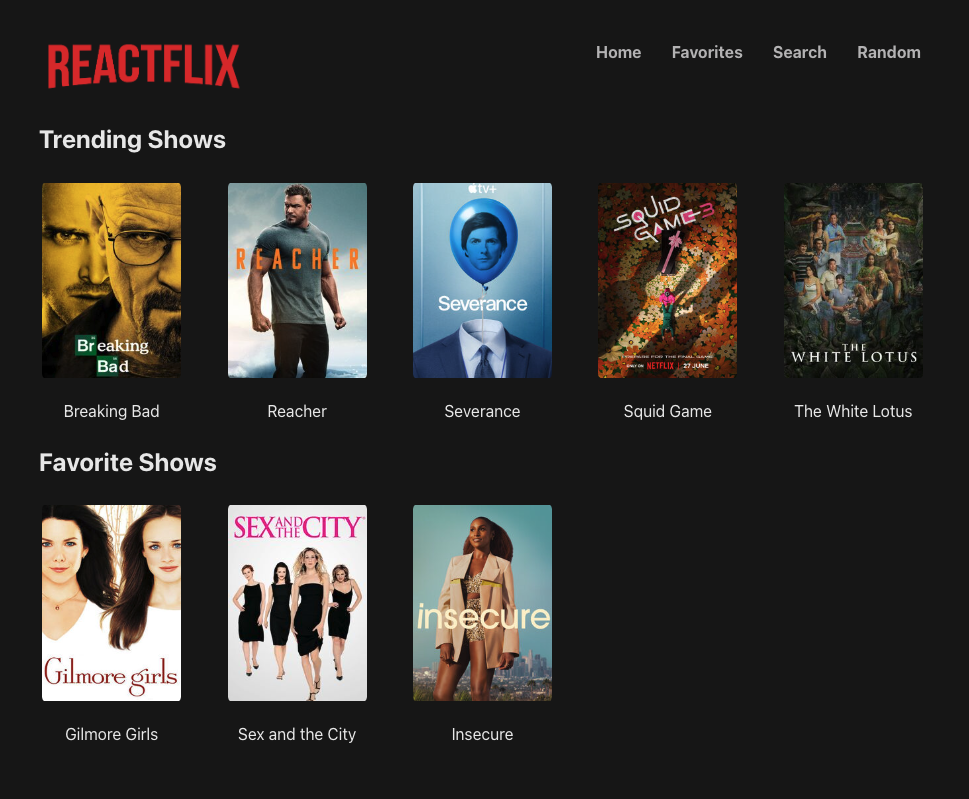
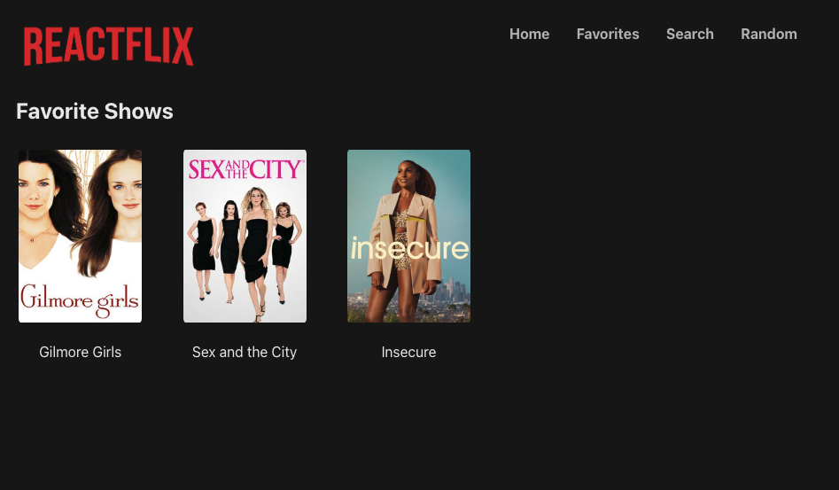
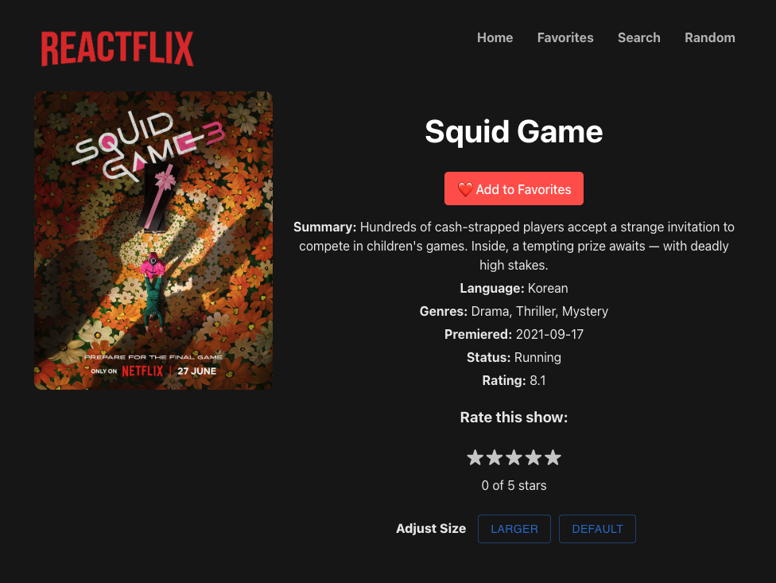
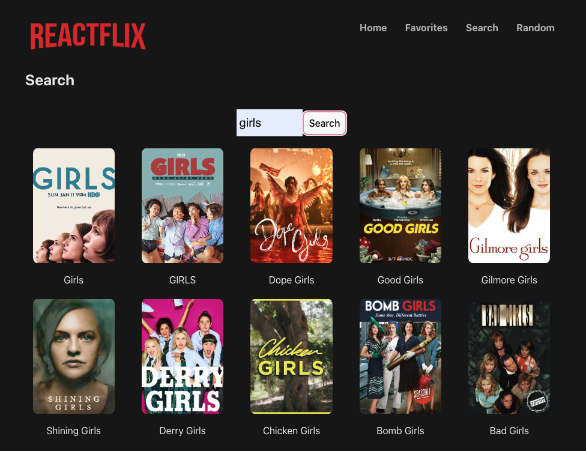

## Table of Contents

1. [Introduction](#introduction)
2. [Project Overview](#project-overview)
   - [Wireframes](#wireframes)
   - [User Stories](#user-stories)
   - [Dev Tests](#jest-tests)
3. [Installation](#installation)
4. [Credits](#credits)

## Introduction

**Problem Statement:** Reactflix - The better Netflix. In a world overwhelmed by too many shows and recommendations, Reactflix offers a truly personalized experience with no ads and a straightforward approach. Users can search for new shows, add them to their list, or view what's trending. (Note: Actual streaming is not currently available.)

**Goal of this project:** The aim is to emulate the design structure of Netflix using the TV Maze API. When users visit the homepage, they are presented with the site's current top 5 trending shows. Directly below, any shows the user has favorited will be displayed. 

In the navigation menu at the top right, users can search for shows or click "Random" to be taken to any show listed on the site. Clicking on any show's banner will lead to a details page, providing basic information about the show. This page also includes functionality for favoriting the show and rating it from 1 to 5 stars.

## Project Overview

### Wireframes

Here are the wireframes for our project, illustrating the main layouts and user flows.

WILL INPUT IMAGES ONCE WE ARE HAPPY WITH THE LAYOUT.

- **Home Page**
  

- **Favorites Page**
  

- **Details Page**
  

- **Search Page**
  

### User Stories

We've come up with the following user stories to guide our development, and make sure our app is a Minimum Viable Product (MVP):

1. **As a user, I want to see the top 5 trending shows on the homepage.**
   - Acceptance Criteria:
     - Upon landing on the homepage, the site will display the 5 top trending TV shows.

2. **As a user, I want to view detailed information about a specific show so that I can learn more about it.**
   - Acceptance Criteria:
     - Clicking on a TV show's banner will navigate to a details page that displays the show's description, rating, language, premiere date, ongoing status, and genre.

3. **As a user, I want to be able to rate a show I want to watch or have watched using a 5-star system.**
   - Acceptance Criteria:
     - On the details page of the TV show, users can rate the show from 1 to 5 stars.

4. **As a user, I want to search for TV shows.**
   - Acceptance Criteria:
     - Entering a word or phrase into the search box will display all TV shows matching that search query.

5. **As a user, I want to see a show's title and poster across all relevant pages.**
   - Acceptance Criteria:
     - On the homepage, favorites page, details page, and search results page, the title and poster of TV shows will be displayed.

6. **As a user, I want to create a favorites list.**
   - Acceptance Criteria:
     - On the details page, a "favorite" button is available. Once clicked, the show is added to the user's favorites list, which is displayed on the homepage under a "Favorites" section.

### Jest Tests

Below are the list of Jest tests we used to help bug test our features:

1. **Test 1**
   - Purpose and result.

2. **Test 2**
   - Purpose and result.

3. **Test 3**
  - Purpose and result.

## Installation

1. **VS Code**
  - To run this app, open the project in VS Code.

2. **NPM Install**
  - In the project directory, run `npm install` in the terminal

3. **React Router DOM**
  - Run `npm install react-router-dom` 

4. **MUI**
  - Run `npm install @mui/material @emotion/react @emotion/styled` 

5. **Run**
  - Run `npm run dev`

## Credits
- Created by: Ashley Reynolds, Robert Prickett, Jesse Baze, Kiersten Morrow
