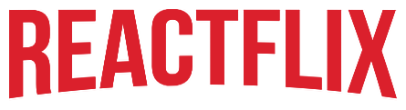

## Table of Contents

1. [Introduction](#introduction)
2. [Project Overview](#project-overview)
   - [Wireframes](#wireframes)
   - [User Stories](#user-stories)
3. [Features](#features)
4. [Installation](#installation)
5. [Credits](#credits)

## Introduction

**Problem Statement:** Reactflix - The better Netflix. In a world overwhelmed by too many shows and recommendations, Reactflix offers a truly personalized experience with no ads and a straightforward approach. Users can search for new shows, add them to their list, or view what's trending. (Note: Actual streaming is not currently available.)

**Goal of this project:** The aim is to emulate the design structure of Netflix using the TV Maze API. When users visit the homepage, they are presented with the site's current top 5 trending shows. Directly below, any shows the user has favorited will be displayed. 

In the navigation menu at the top right, users can search for shows or click "Random" to be taken to any show listed on the site. Clicking on any show's banner will lead to a details page, providing basic information about the show. This page also includes functionality for favoriting the show and rating it from 1 to 5 stars.

## Project Overview

### Wireframes

Here are the wireframes for our project, illustrating the main layouts and user flows:

WILL INPUT IMAGES ONCE WE HAPPY WITH THE LAYOUT

- **Home Page**
  

- **Favorites Page**
  

- **Details Page**
  

- **Search Page**
  

### User Stories

We've came up with the following user stories to guide our development:

1. **As a user, I want to see the top 5 trending shows.**
   - Acceptance Criteria:
     - Words words words.

2. **As a user, I want to view detailed information about a specific show so that I can learn more about it.**
   - Acceptance Criteria:
     - Words words words.

3. **As a user, I want to be able to rate a show (5-stars) I want to watch/have watched.**
   - Acceptance Criteria:
     - Words words words.

4. **As a user, I will want to search by id.**
   - Acceptance Criteria:
     - Words words words.

5. **As a user, I want to see a show’s title and poster**
   - Acceptance Criteria:
     - Words words words.
    
6. **As a user, I would like to make a favorites list**
   - Acceptance Criteria:
     - Words words words.

## Features

The following features have been identified as essential for our Minimum Viable Product (MVP):

1. **Home Page with Trending Shows**
   - Reasoning: Words words words.

2. **Show Details Page**
   - Reasoning: 

3. **Favorites Functionality**
   - Reasoning: 

4. **Search Functionality**
   - Reasoning: 

5. **Random Show Suggestion**
   - Reasoning: 

## Installation

- Words words words.

## Credits
- Created by: Ashley Reynolds, Robert Prickett, Jesse Baze, Kiersten Morrow
